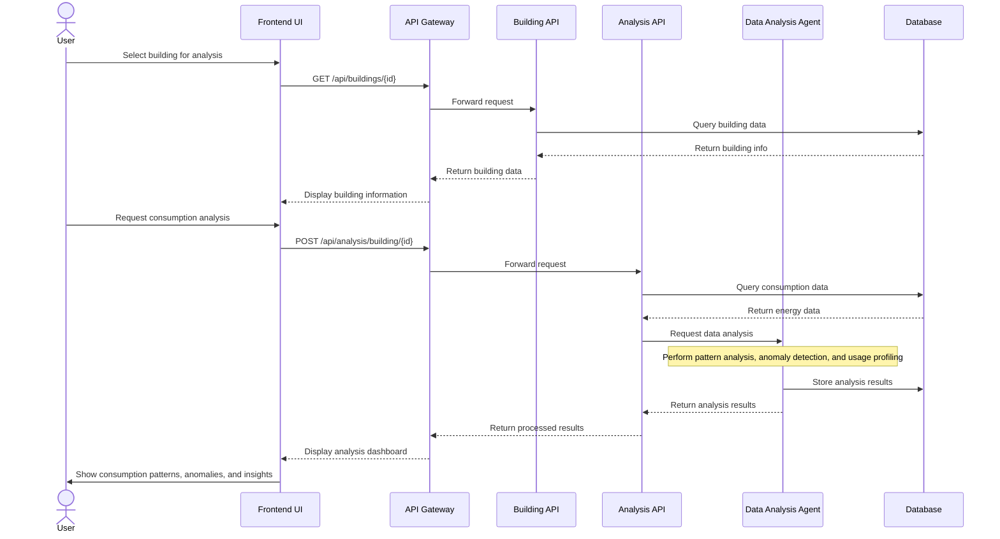
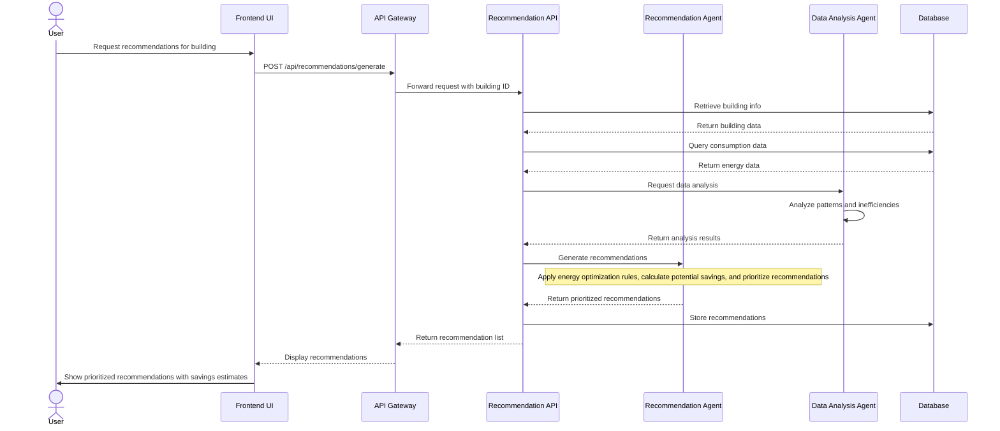
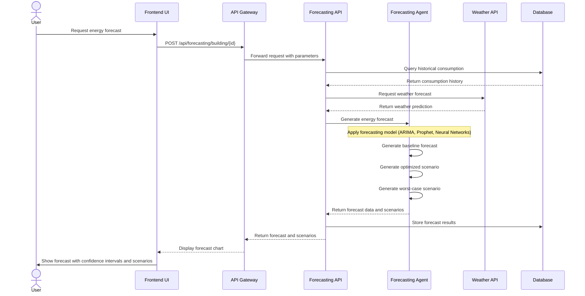
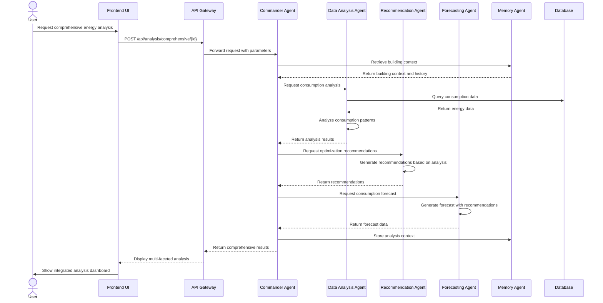
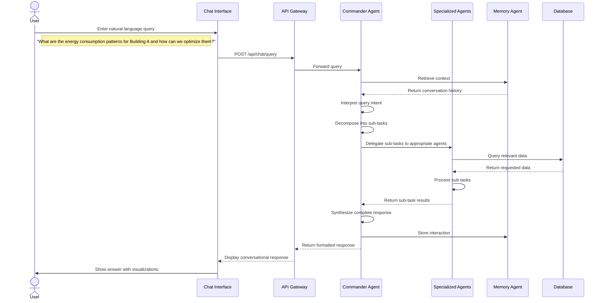
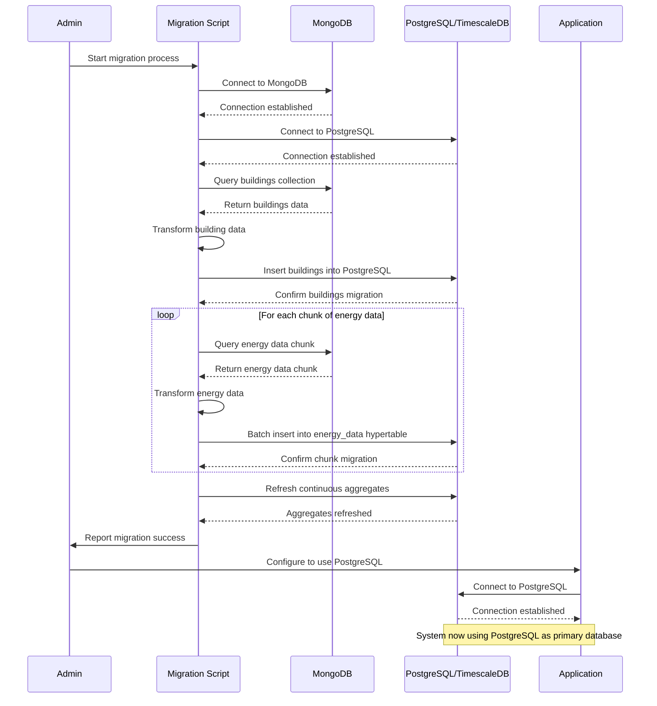
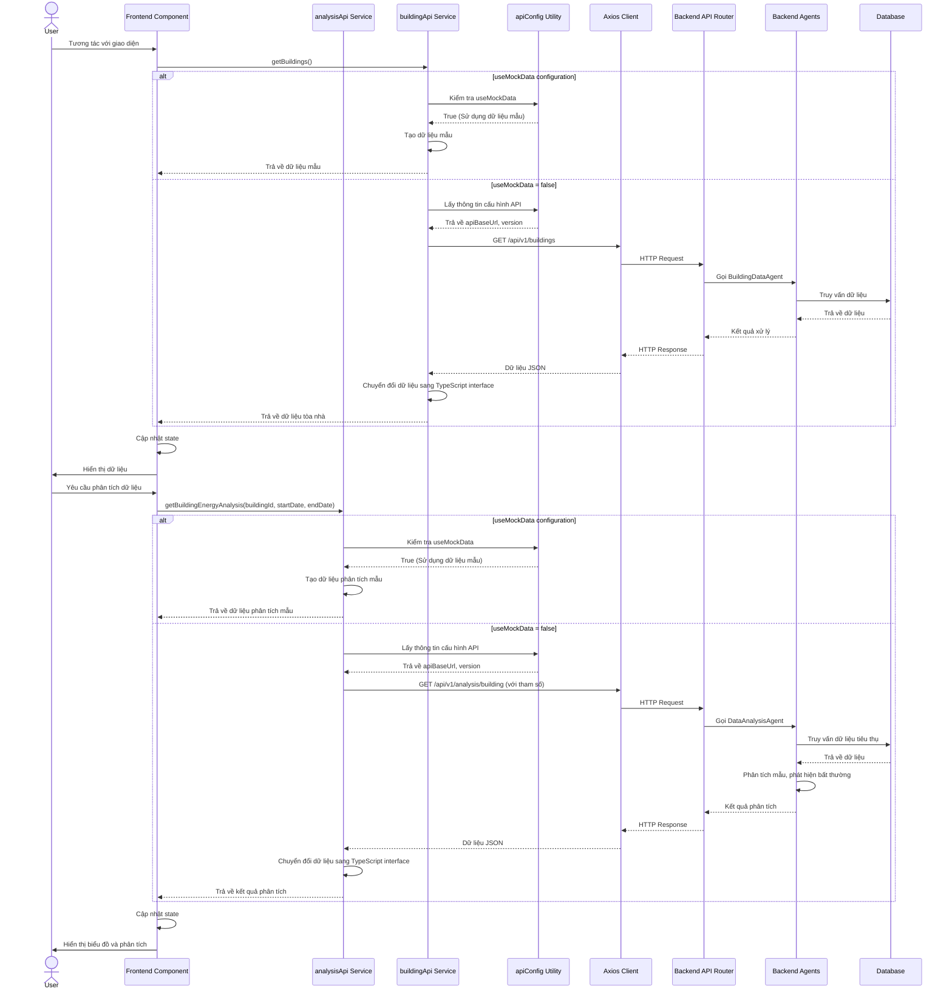
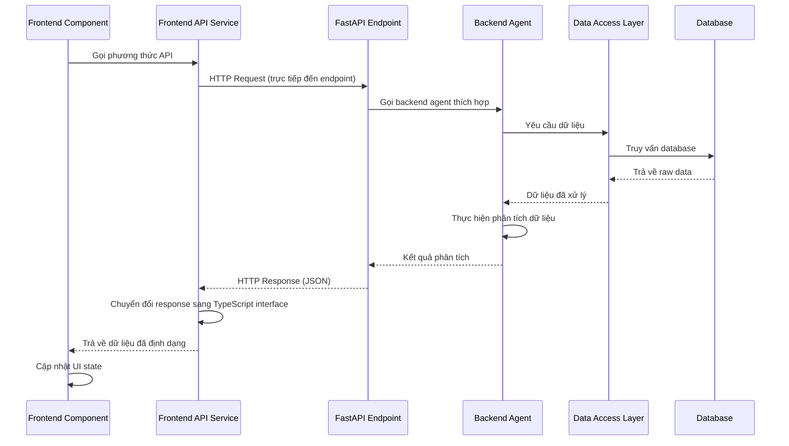

# Energy AI Optimizer Sequence Diagrams

This document contains sequence diagrams for key processes in the Energy AI Optimizer system, illustrating the interactions between components during typical operations.

## 1. Building Energy Consumption Analysis

This sequence diagram illustrates the process of analyzing energy consumption data for a building.

## 2. Recommendation Generation Process

This sequence diagram shows how energy optimization recommendations are generated and presented to the user.

## 3. Energy Consumption Forecasting

This sequence diagram illustrates the process of generating energy consumption forecasts.

## 4. Multi-Agent Collaboration for Complex Analysis

This sequence diagram shows how multiple agents collaborate for complex energy analysis tasks.

## 5. User Interaction with Natural Language Interface

This sequence diagram illustrates how users can interact with the system using natural language.

## 6. Data Migration Process (MongoDB to PostgreSQL)

This sequence diagram shows the process of migrating data from MongoDB to PostgreSQL.

## 7. Frontend API Integration with Backend Services

Biểu đồ trình tự này mô tả cách các thành phần frontend tương tác với backend thông qua các dịch vụ API.

## 8. Chi tiết luồng dữ liệu API hiện tại (Direct Endpoints)

Biểu đồ này minh họa luồng dữ liệu hiện tại mà không sử dụng API Gateway.

These sequence diagrams illustrate the key processes and interactions within the Energy AI Optimizer system, showing how the different components collaborate to analyze energy data, generate insights, and provide recommendations to users. 