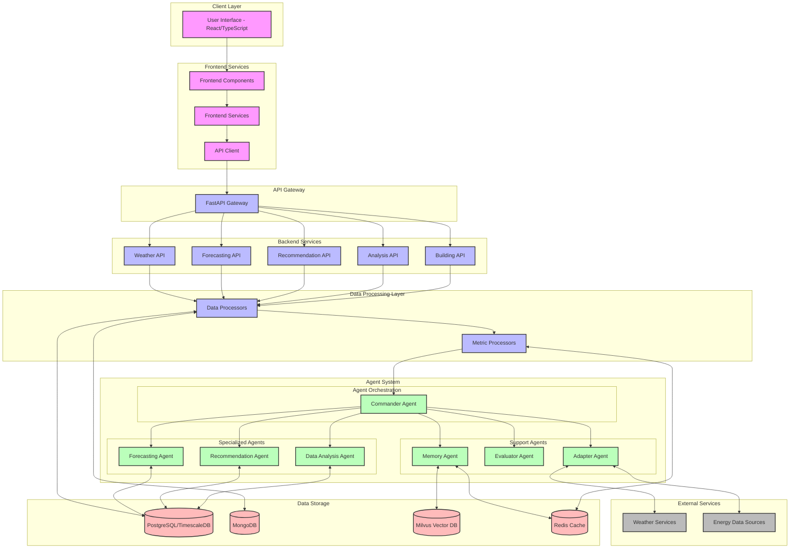

# Energy AI Optimizer System Architecture

## Overview

The Energy AI Optimizer is a multi-agent system designed to analyze building energy consumption data, identify optimization opportunities, and provide actionable recommendations. The system uses Microsoft AutoGen for agent implementation and follows a microservices architecture with a Python backend for AI/ML processing and a Node.js/React frontend for the user interface.

## System Components

The architecture consists of the following main components:

1. **Frontend Application**: React/TypeScript-based user interface providing dashboards, analytics, forecasting, and recommendation views
2. **Backend API**: FastAPI-based service that handles data processing, agent orchestration, and exposes RESTful endpoints
3. **Database Layer**: Supports both MongoDB and PostgreSQL with TimescaleDB for time-series data
4. **Agent System**: Multiple AI agents built with Microsoft AutoGen framework
5. **Vector Database**: Milvus for storing and querying vector embeddings
6. **Caching Layer**: Redis for caching frequent queries and pub/sub messaging

## Architecture Diagram

## Component Descriptions

### Frontend Application
- **User Interface**: React-based interface with role-specific views for facility managers, energy analysts, and executives
- **Frontend Components**: Reusable UI components for dashboards, charts, and recommendations
- **Frontend Services**: Services for data fetching, state management, and API communication
- **API Client**: Client-side module for communicating with the backend API

### Backend API
- **API Gateway**: FastAPI application serving as the entry point for all client requests
- **Building API**: Endpoints for building information and consumption data
- **Analysis API**: Endpoints for energy consumption analysis and anomaly detection
- **Recommendation API**: Endpoints for energy optimization recommendations
- **Forecasting API**: Endpoints for energy consumption forecasting
- **Weather API**: Endpoints for weather data and correlations with energy usage

### Data Processing Layer
- **Data Processors**: Components for processing raw building and energy data
- **Metric Processors**: Components for calculating energy metrics and KPIs

### Agent System
- **Commander Agent**: Coordinates activities between specialized agents
- **Data Analysis Agent**: Analyzes energy consumption patterns and anomalies
- **Recommendation Agent**: Generates energy optimization recommendations
- **Forecasting Agent**: Predicts future energy consumption
- **Memory Agent**: Maintains system knowledge and historical data
- **Evaluator Agent**: Assesses outcomes of energy optimization strategies
- **Adapter Agent**: Interfaces with external systems and data sources

### Data Storage
- **PostgreSQL/TimescaleDB**: Primary database for time-series energy data
- **MongoDB**: Document database used during transition to PostgreSQL
- **Milvus Vector DB**: Vector database for semantic search and agent memory
- **Redis Cache**: In-memory cache for frequent queries and pub/sub messaging

### External Services
- **Weather Services**: APIs for weather data and forecasts
- **Energy Data Sources**: External sources of energy consumption data

## Data Flow

1. User interacts with the frontend interface
2. Frontend services make API requests to the backend
3. API Gateway routes requests to appropriate backend services
4. Backend services process requests and interact with the data layer
5. Specialized agents analyze data and generate insights
6. Results are stored in the database and returned to the frontend
7. Frontend displays results to the user

## Deployment Model

The system uses Docker containers orchestrated with Docker Compose, with each major component running in its own container:

- Frontend container (Node.js)
- Backend container (Python/FastAPI)
- PostgreSQL/TimescaleDB container
- MongoDB container
- Redis container
- Milvus container (with etcd and MinIO dependencies)

This containerized approach allows for easy deployment and scalability while ensuring consistent environments across development and production. 